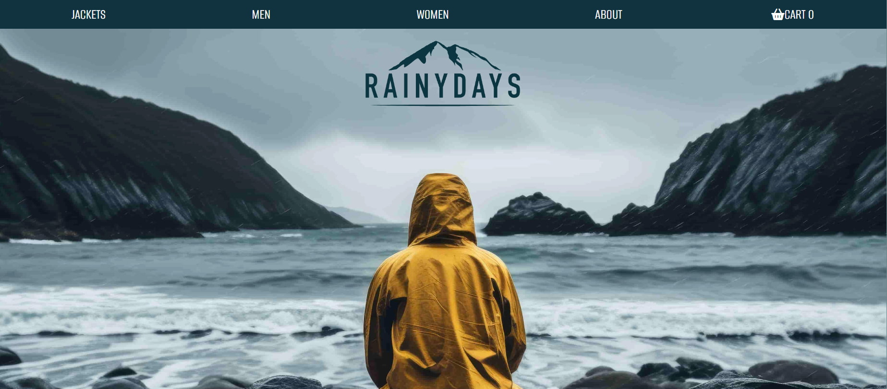

# JAVASCRIPT 1 - RainyDays

RainyDays is an interactive online store built with JavaScript that fetches product data from an API. It allows users to browse, filter, and view detailed products, manage a shopping basket, and complete checkout with confirmation. Key features like asynchronous data loading, error handling, and dynamic user interaction have been implemented.

# Description:

This project is a fully functional online store developed using JavaScript, designed to interact with an external API to dynamically display products. The application supports browsing a product list of sale items on the homepage, filtering by gender, and viewing detailed information on individual product pages. Users can add items to their basket, remove them if needed, and review their cart during checkout. Upon completing a purchase, a confirmation screen is displayed.

The implementation uses modern JavaScript features such as async/await for handling API calls, includes error handling to inform users of issues, and shows loading indicators during data fetches to improve user experience. The project covers essential pages like the homepage, product detail page, checkout, and confirmation, ensuring a complete shopping workflow. This codebase is accessible, dynamic, and avoids hardcoded product data, demonstrating practical skills in API integration and interactive UI design.

## Built with:

- HTML 
- CSS
- JavaScript

## Getting Started 

### Installing

1. Clone the repo: 

https://github.com/camiP89/assignment-js1-rainydays.git

2. Install Live server in VS Code - npm install

### Running

1. Right-click the index.html file and select "Open with live server".

## View my live website which is hosted on Netlify: 

[My live website]https://camip89.github.io/assignment-js1-rainydays/

# Contact

[My email address]campug04041@stud.noroff.no

# Acknowledgments 

- Martin Kruger: JS1 Assignment - RainyDays. 
